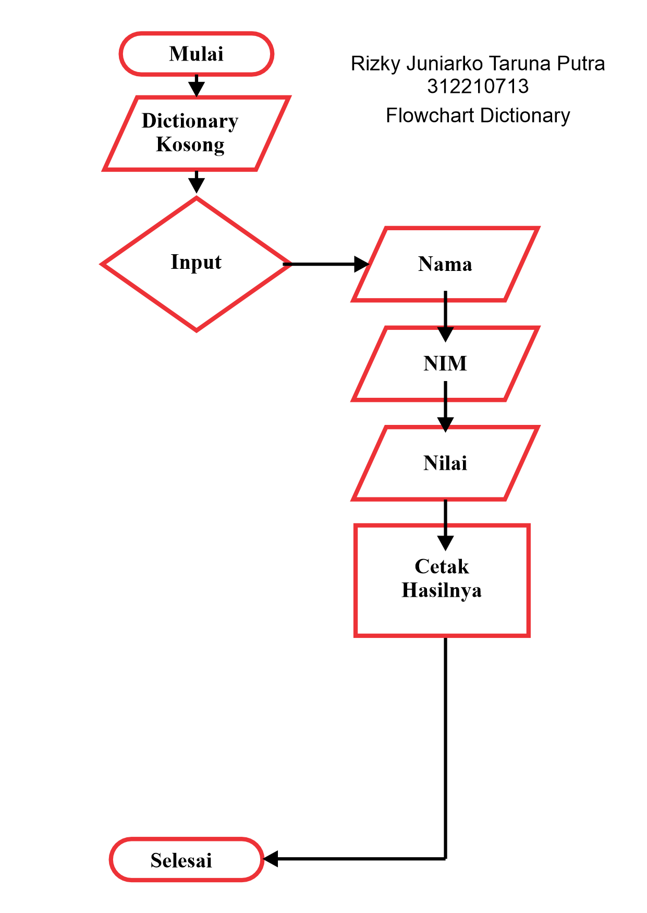
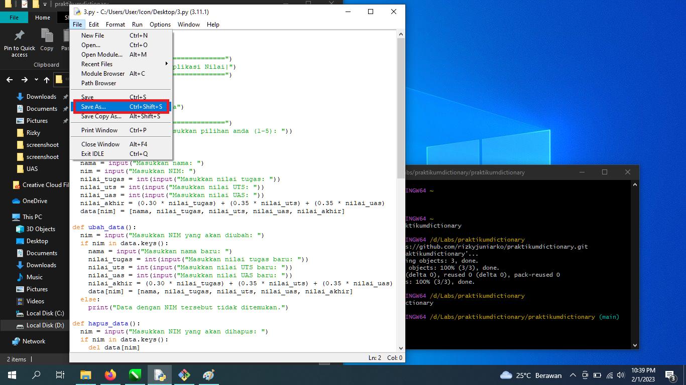
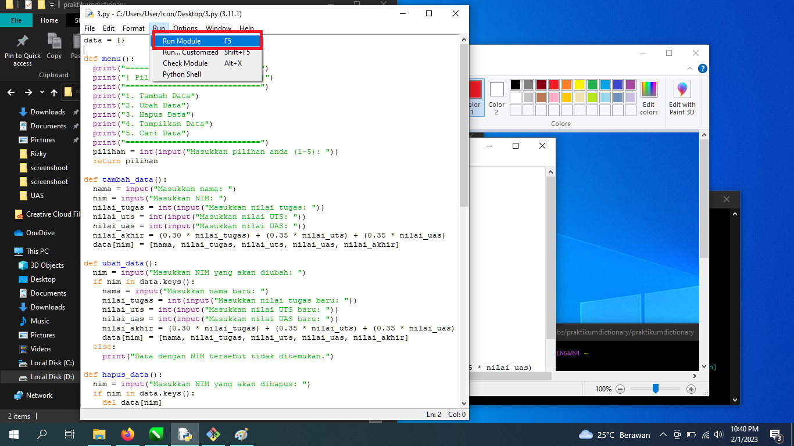
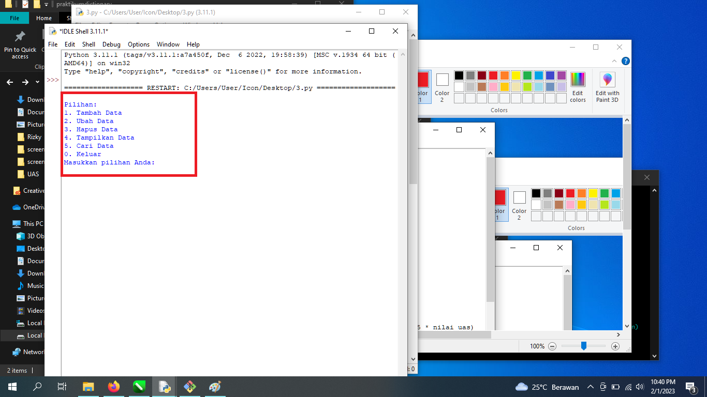
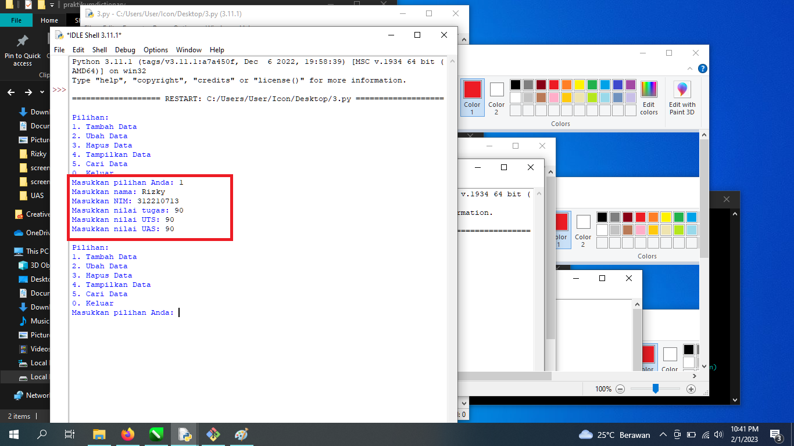
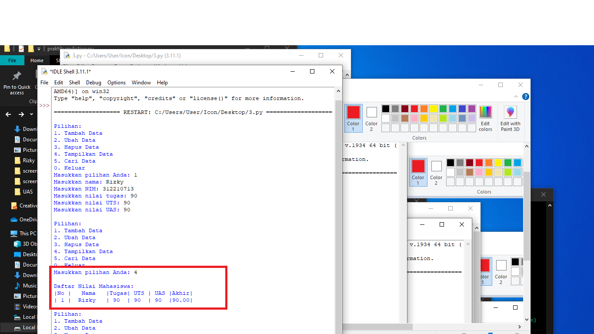

# praktikumdictionary

# Flowchart untuk membuat program directory

# Tutorial Membuat Program Dictionary Di Phyton
Buka Idle Phtyon, Lalu buat file baru
1[gambar2](screenshoot/ss1.png)
Pastekan kode berikut :

data = {}

def menu():
  print("=============================")
  print("| Pilihan Menu Aplikasi Nilai|")
  print("=============================")
  print("1. Tambah Data")
  print("2. Ubah Data")
  print("3. Hapus Data")
  print("4. Tampilkan Data")
  print("5. Cari Data")
  print("=============================")
  pilihan = int(input("Masukkan pilihan anda (1-5): "))
  return pilihan

def tambah_data():
  nama = input("Masukkan nama: ")
  nim = input("Masukkan NIM: ")
  nilai_tugas = int(input("Masukkan nilai tugas: "))
  nilai_uts = int(input("Masukkan nilai UTS: "))
  nilai_uas = int(input("Masukkan nilai UAS: "))
  nilai_akhir = (0.30 * nilai_tugas) + (0.35 * nilai_uts) + (0.35 * nilai_uas)
  data[nim] = [nama, nilai_tugas, nilai_uts, nilai_uas, nilai_akhir]

def ubah_data():
  nim = input("Masukkan NIM yang akan diubah: ")
  if nim in data.keys():
    nama = input("Masukkan nama baru: ")
    nilai_tugas = int(input("Masukkan nilai tugas baru: "))
    nilai_uts = int(input("Masukkan nilai UTS baru: "))
    nilai_uas = int(input("Masukkan nilai UAS baru: "))
    nilai_akhir = (0.30 * nilai_tugas) + (0.35 * nilai_uts) + (0.35 * nilai_uas)
    data[nim] = [nama, nilai_tugas, nilai_uts, nilai_uas, nilai_akhir]
  else:
    print("Data dengan NIM tersebut tidak ditemukan.")

def hapus_data():
  nim = input("Masukkan NIM yang akan dihapus: ")
  if nim in data.keys():
    del data[nim]
  else:
    print("Data dengan NIM tersebut tidak ditemukan.")

def tampilkan_data():
    if len(data) == 0:
        print("Data kosong.")
        return
    print("\nDaftar Nilai Mahasiswa:")
    print("|{:^3}|{:^10}|{:^5}|{:^5}|{:^5}|{:^5}|".format("No", "Nama", "Tugas", "UTS", "UAS", "Akhir"))
    for i, x in enumerate(data.values()):
        print("|{:^3}|{:^10}|{:^5}|{:^5}|{:^5}|{:^5.2f}|".format(i+1, x[0], x[1], x[2], x[3], x[4]))

def cari_data(data, cari):
    found = False
    print("Hasil Pencarian:")
    print("No.  NIM         Nama             Tugas    UTS    UAS    Akhir")
    i = 0
    for x in data.values():
        if cari.lower() in x['Nama'].lower() or cari.lower() in x['NIM'].lower():
            found = True
            i += 1
            print("{0}.  {1:<10}  {2:<15}  {3:<7}  {4:<5}  {5:<5}  {6:<5}".format(i, x['NIM'], x['Nama'], x['Tugas'], x['UTS'], x['UAS'], x['Akhir']))
    if not found:
        print("Data tidak ditemukan!")
        
while True:
    print("\nPilihan:")
    print("1. Tambah Data")
    print("2. Ubah Data")
    print("3. Hapus Data")
    print("4. Tampilkan Data")
    print("5. Cari Data")
    print("0. Keluar")
    pilihan = int(input("Masukkan pilihan Anda: "))
    if pilihan == 1:
        tambah_data()
    elif pilihan == 2:
        ubah_data()
    elif pilihan == 3:
        hapus_data()
    elif pilihan == 4:
        tampilkan_data()
    elif pilihan == 5:
        cari_data()
    elif pilihan == 0:
        break
    else:
        print("Pilihan salah!")
![gambar3](screenshoot/ss2.png
lalu save as

setelah save selesai, klik run

maka akan muncul menu berikut yang bisas kita pilih opsinya

misal kita mau menambahkna data, dengan mengetik opsi 1

dan hasilnya akan muncul

bila telah selesai bisa memilih opsi 0.